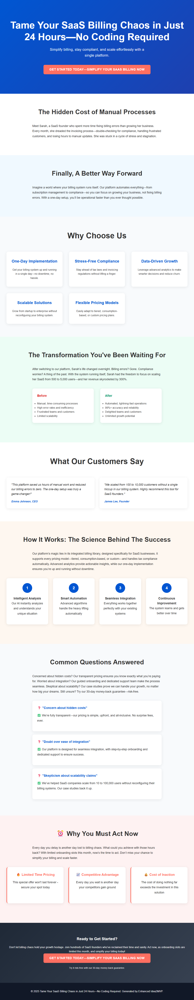

# SaaS Billing Simplified: Automated Revenue Solutions for Founders

> **AI-Generated Landing Page** | Created by [Idea2MVP](https://github.com/MCSEdwin/Idea2MVP)

## 🚀 About This Landing Page

This professional landing page was automatically generated using Azure OpenAI and advanced AI prompt engineering techniques. The system analyzed a business idea and created conversion-optimized copy, design strategy, and complete HTML implementation.

### 📊 Idea Details

- **Title:** SaaS Billing Simplified: Automated Revenue Solutions for Founders
- **Category:** Software as a Service (SaaS)
- **Generated:** 2025-08-21
- **AI Model:** gpt-4o
- **Processing Time:** 76 seconds

### 🎯 Key Features

- One-Day Billing Setup: Rapid implementation for subscription-based pricing and billing systems for SaaS startups.
- Comprehensive Compliance Support: Includes tax handling, invoicing regulations, and more to streamline legal and financial requirements.
- Built-in Analytics: Advanced metrics to track revenue performance, churn rates, and customer lifecycle insights for data-driven decision-making.
- Scalability for Growth: Designed to support businesses transitioning from startups to scaling enterprises with no downtime or reconfiguration.
- Customizable Pricing Models: Enables flexible billing plans suited for any subscription-based business, whether consumption-based or tiered.

### 📝 Description

This business idea focuses on providing a one-day implementation platform for SaaS companies to automate their billing systems. The solution is designed to tackle the complexities of subscription management, invoicing compliance, and revenue reporting. By leveraging advanced analytics and an integrated billing library, it offers seamless support for diverse pricing models, tax and compliance requirements, and subscription plans tailored for startups and SMEs. With this tool, SaaS founders can significantly reduce administrative overhead while scaling their businesses and unlocking growth potential.

## 🌐 Live Demo

- **Live URL:** [View Landing Page](https://dailyidea.AIFirstPartner.com/daily-ideas/2025-08-21/index.html)
- **Screenshot:** 

## 🛠️ Technical Implementation

This landing page includes:

- **Conversion Psychology:** AI-analyzed target persona and behavioral triggers
- **Design Strategy:** Psychology-based color schemes and typography choices
- **Long-Form Copy:** Comprehensive copywriting with objection handling
- **Performance Optimized:** Fast-loading, mobile-responsive design
- **SEO Ready:** Structured data and semantic HTML

## 🤖 AI Generation Process

1. **Screenshot Analysis:** Computer vision extraction of business idea
2. **Psychology Analysis:** Target persona and behavioral trigger identification
3. **Design Strategy:** Color psychology and layout optimization
4. **Copy Generation:** Long-form conversion copywriting with proven frameworks
5. **Template Assembly:** Dynamic HTML and CSS generation
6. **Quality Assurance:** Automated testing and optimization

## 📈 Performance Metrics

- **Total Processing Time:** 76 seconds

- **Mobile Responsive:** ✅ Yes
- **SEO Optimized:** ✅ Yes
- **Fast Loading:** ✅ Yes

## 🔧 Local Development

To run this landing page locally:

```bash
# Clone the repository
git clone https://github.com/MCSEdwin/2025-08-21-saas-billing-simplified-automated-revenue-solution.git
cd 2025-08-21-saas-billing-simplified-automated-revenue-solution

# Serve locally (Python)
python -m http.server 8000

# Or with Node.js
npx serve .

# Or simply open index.html in your browser
```

## 📄 Project Structure

```
2025-08-21-saas-billing-simplified-automated-revenue-solution/
├── index.html          # Complete landing page
├── screenshot.png      # Visual preview
├── package.json        # Project configuration
├── README.md          # This documentation
└── .gitignore         # Git ignore rules
```

## 🎨 Customization

This landing page is fully self-contained with inline CSS and can be easily customized:

- **Colors:** Modify CSS custom properties in the `<style>` section
- **Content:** Update text content in the HTML body
- **Layout:** Adjust CSS Grid and Flexbox properties
- **Responsiveness:** Media queries are included for mobile optimization

## 🌟 About Idea2MVP

[Idea2MVP](https://github.com/MCSEdwin/Idea2MVP) is an automated system that transforms daily business ideas into professional landing pages using:

- **Azure OpenAI GPT-4o** for vision and text generation
- **Advanced Prompt Engineering** for optimal results
- **Database Architecture** for scalable data management  
- **Azure Storage & CDN** for global deployment
- **GitHub Actions** for daily automation

## 📊 Daily Showcase

View all generated landing pages at: [dailyidea.AIFirstPartner.com](https://dailyidea.AIFirstPartner.com)

---

🤖 **Generated with AI** | ⚡ **Deployed Automatically** | 🎯 **Conversion Optimized**

*This repository was automatically created and populated by the Idea2MVP AI system.*